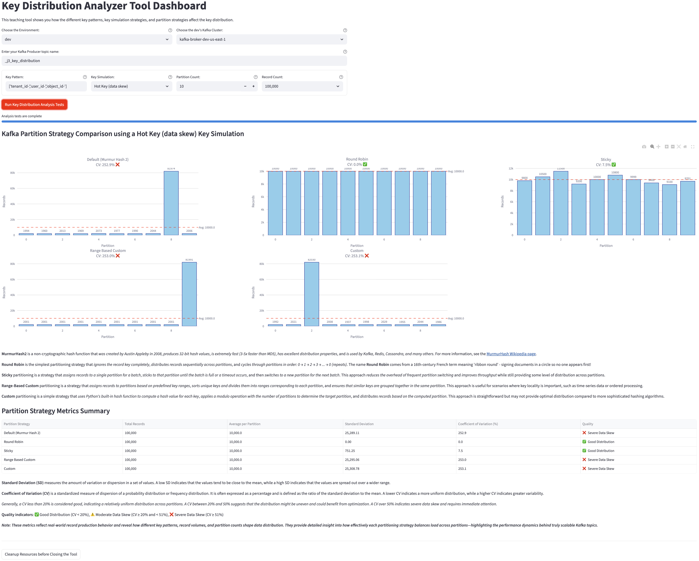
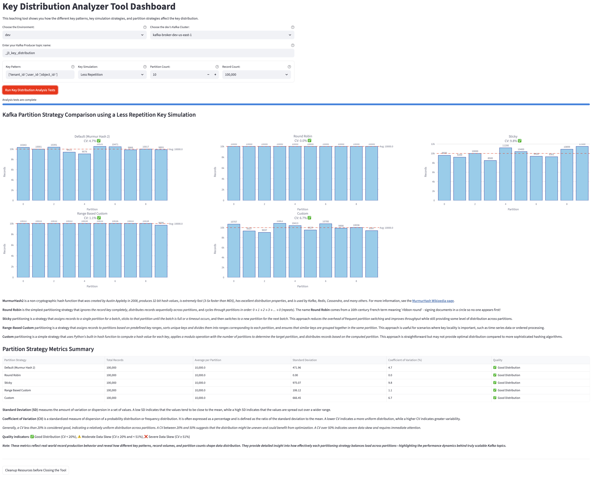
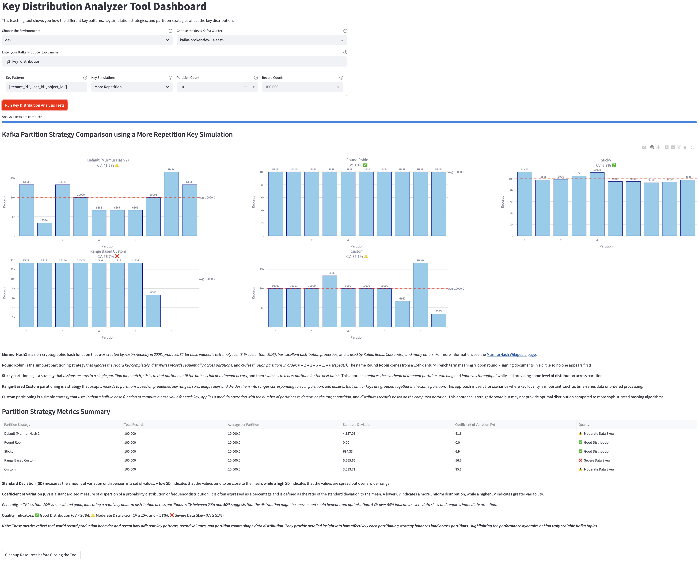
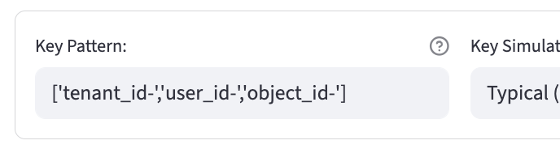
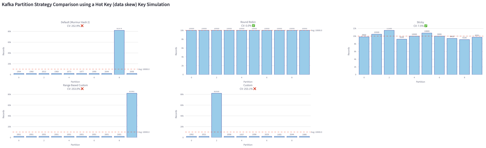

# Kafka Cluster Topic Key Distribution Analyzer Tool
Efficient **Kafka key distribution** is fundamental to building scalable, high-performance event-driven systems. Kafka uses each record’s key to determine which partition it belongs to—governing **data ordering**, **load balancing**, and **parallelism** across the cluster. When key distribution is uneven, some partitions become hot, processing far more traffic than others. These **hot partitions** lead to broker overload, consumer lag, and throttled throughput, undermining the scalability of your Kafka workloads.

This tool helps you **test**, **visualize**, and **validate** how record keys are distributed across topic partitions in your Kafka cluster. It generates records using configurable key patterns, publishes them to a target topic, and then consumes the data to analyze partition utilization and message distribution metrics.

By surfacing patterns of **data skew**, **low-key cardinality**, or **biased hashing**, the analyzer reveals whether your partitioning strategy is truly balanced. The results empower you to:
* Detect and diagnose **hot partitions** before they degrade performance.
* Experiment with **key-salting** or **hashing strategies** to improve balance.
* Optimize **consumer parallelism** and **broker load** for predictable throughput at scale.

Use this tool as a **proactive performance lens** on your Kafka topics—ensuring your cluster’s data distribution is as efficient, scalable, and reliable as the workloads it powers.

**Table of Contents**

<!-- toc -->
- [**1.0 To get started**](#10-to-get-started)
   + [**1.1 Download the Tool**](#11-download-the-tool)
   + [**1.2 Configure the Tool**](#12-configure-the-tool)
      - [**1.2.1 Create a Dedicated Service Account for the Analyzer Tool**](#121-create-a-dedicated-service-account-for-the-analyzer-tool)
      - [**1.2.2 Create the `.env` file**](#122-create-the-env-file)
      - [**1.2.3 Using the AWS Secrets Manager (optional)**](#123-using-the-aws-secrets-manager-optional)
   + [**1.3 Run the Tool**](#13-run-the-tool)
      - [**1.3.1 Did you notice we prefix `uv run` to `streamlit run src/tool.py`?**](#131-did-you-notice-we-prefix-uv-run-to-streamlit-run-srctoolpy)
      - [**1.3.2 A word about Streamlit!**](#132-a-word-about-streamlit)
      - [**1.3.3 Troubleshoot Connectivity Issues (if any)**](#133-troubleshoot-connectivity-issues-if-any)
   + [**1.4 The Results**](#14-the-results)
      - [**1.4.1 Example of Hot Key Data Skew Simulation Results**](#141-example-of-hot-key-data-skew-simulation-results)
      - [**1.4.2 Example of Normal Key Distribution Simulation Results**](#142-example-of-normal-key-distribution-simulation-results)
      - [**1.4.3 Example of Low Cardinality Key Distribution Simulation Results**](#143-example-of-low-cardinality-key-distribution-simulation-results)
      - [**1.4.4 Example of High Cardinality Key Distribution Simulation Results**](#144-example-of-high-cardinality-key-distribution-simulation-results)
      - [**1.4.5 Example of No Repetition Key Distribution Simulation Results**](#145-example-of-no-repetition-key-distribution-simulation-results)
- [**2.0 How the Tool Works**](#20-how-the-tool-works)
    + [**2.1 The Dashboard**](#21-the-dashboard)
        - [**2.1.1 `Key Pattern`**](#211-key-pattern)
        - [**2.1.2 `Key Simulation`**](#212-key-simulation)
        - [**2.1.3 The Bar Charts**](#213-the-bar-charts)
    + [**2.2 End-to-End Flow**](#22-end-to-end-flow)
- [**3.0 Resources**](#30-resources)
    + [**3.1 Confluent Blogs and Documentation**](#31-confluent-blogs-and-documentation)
<!-- tocstop -->

## **1.0 To get started**

[**_Download_**](#11-download-the-tool) ---> [**_Configure_**](#12-configure-the-tool) ---> [**_Run_**](#13-run-the-tool) ---> [**_Results_**](#14-the-results)

### 1.1 Download the Tool
Clone the repo:
    ```shell
    git clone https://github.com/j3-signalroom/kafka_cluster-topic-key_distribution_analyzer-tool.git
    ```

Since this project was built using [**`uv`**](https://docs.astral.sh/uv/), please [install](https://docs.astral.sh/uv/getting-started/installation/) it, and then run the following command to install all the project dependencies:
   ```shell
   uv sync
   ```

### **1.2 Configure the Tool**

Now, you need to set up the tool by creating a `.env` file in the root directory of your project. This file will store all the essential environment variables required for the tool to connect to your Confluent Cloud Platform and function correctly. Additionally, you can choose to use **AWS Secrets Manager** to manage your secrets.

#### **1.2.1 Create a Dedicated Service Account for the Analyzer Tool**
The service account needs to have [OrganizationAdmin](https://docs.confluent.io/cloud/current/security/access-control/rbac/predefined-rbac-roles.html#organizationadmin), [EnvironmentAdmin](https://docs.confluent.io/cloud/current/security/access-control/rbac/predefined-rbac-roles.html#environmentadmin) or [CloudClusterAdmin](https://docs.confluent.io/cloud/current/security/access-control/rbac/predefined-rbac-roles.html#cloudclusteradmin) role to provision Kafka cluster API keys and the [MetricsViewer](https://docs.confluent.io/cloud/current/security/access-control/rbac/predefined-rbac-roles.html#metricsviewer-role) role to access the Metrics API for all clusters it has access to.

1. Use the [Confluent CLI (Command-Line Interface)](https://docs.confluent.io/confluent-cli/current/overview.html) to create the service account:

   > **Note:** If you haven't already, install the [Confluent CLI](https://docs.confluent.io/confluent-cli/current/overview.html) and log in to your Confluent Cloud account using `confluent login`.  Moreover, the account you use to log in must have the [OrganizationAdmin](https://docs.confluent.io/cloud/current/security/access-control/rbac/predefined-rbac-roles.html#organizationadmin) role to create the **Cloud API key in Step 5**.

   ```shell
   confluent iam service-account create <SERVICE_ACCOUNT_NAME> --description "<DESCRIPTION>"
   ```

   For instance, you run `confluent iam service-account create recommender-service-account --description "Service account for Recommender Tool"`, the output should resemble:
   ```shell
   +-------------+--------------------------------+
   | ID          | sa-abcd123                     |
   | Name        | recommender-service-account    |
   | Description | Service account for            |
   |             | Recommender Tool               |
   +-------------+--------------------------------+
   ```
2. Make note of the service account ID in the output, which is in the form `sa-xxxxxxx`, which you will assign the [OrganizationAdmin](https://docs.confluent.io/cloud/current/security/access-control/rbac/predefined-rbac-roles.html#organizationadmin), [EnvironmentAdmin](https://docs.confluent.io/cloud/current/security/access-control/rbac/predefined-rbac-roles.html#environmentadmin) or [CloudClusterAdmin](https://docs.confluent.io/cloud/current/security/access-control/rbac/predefined-rbac-roles.html#cloudclusteradmin) role, and [MetricsViewer](https://docs.confluent.io/cloud/current/security/access-control/rbac/predefined-rbac-roles.html#metricsviewer-role) role to in the next steps, and assign it to the `PRINCIPAL_ID` environment variable in the `.env` file.

3. Decide at what level you want to assign the [OrganizationAdmin](https://docs.confluent.io/cloud/current/security/access-control/rbac/predefined-rbac-roles.html#organizationadmin), [EnvironmentAdmin](https://docs.confluent.io/cloud/current/security/access-control/rbac/predefined-rbac-roles.html#environmentadmin) or [CloudClusterAdmin](https://docs.confluent.io/cloud/current/security/access-control/rbac/predefined-rbac-roles.html#cloudclusteradmin) role to the service account.  The recommended approach is to assign the role at the organization level so that the service account can provision API keys for any Kafka cluster in the organization.  If you want to restrict the service account to only be able to provision API keys for Kafka clusters in a specific environment, then assign the EnvironmentAdmin role at the environment level.  If you want to restrict the service account to only be able to provision API keys for a specific Kafka cluster, then assign the CloudClusterAdmin role at the cluster level.

   For example, to assign the [EnvironmentAdmin](https://docs.confluent.io/cloud/current/security/access-control/rbac/predefined-rbac-roles.html#environmentadmin) role at the environment level:
   ```shell
   confluent iam rbac role-binding create --role EnvironmentAdmin --principal User:<SERVICE_ACCOUNT_ID> --environment <ENVIRONMENT_ID>
   ```

   Or, to assign the [CloudClusterAdmin](https://docs.confluent.io/cloud/current/security/access-control/rbac/predefined-rbac-roles.html#cloudclusteradmin) role at the cluster level:
   ```shell
   confluent iam rbac role-binding create --role CloudClusterAdmin --principal User:<SERVICE_ACCOUNT_ID> --cluster <KAFKA_CLUSTER_ID>
   ```

   For instance, you run `confluent iam rbac role-binding create --role EnvironmentAdmin --principal User:sa-abcd123 --environment env-123abc`, the output should resemble:
   ```shell
   +-----------+------------------+
   | ID        | rb-j3XQ8Y        |
   | Principal | User:sa-abcd123  |
   | Role      | EnvironmentAdmin |
   +-----------+------------------+
   ```

4. Assign the [MetricsViewer](https://docs.confluent.io/cloud/current/security/access-control/rbac/predefined-rbac-roles.html#metricsviewer-role) role to the service account at the organization, environment, or cluster level,  For example to assign the [MetricsViewer](https://docs.confluent.io/cloud/current/security/access-control/rbac/predefined-rbac-roles.html#metricsviewer-role) role at the environment level:
   ```shell
   confluent iam rbac role-binding create --role MetricsViewer --principal User:<SERVICE_ACCOUNT_ID> --environment <ENVIRONMENT_ID>
   ```

   For instance, you run `confluent iam rbac role-binding create --role MetricsViewer --principal User:sa-abcd123 --environment env-123abc`, the output should resemble:
   ```shell
   +-----------+------------------+
   | ID        | rb-1GgVMN        |
   | Principal | User:sa-abcd123  |
   | Role      | MetricsViewer    |
   +-----------+------------------+
   ```

5. Create an API key for the service account:
   ```shell
   confluent api-key create --resource cloud --service-account <SERVICE_ACCOUNT_ID> --description "<DESCRIPTION>"
   ```

   For instance, you run `confluent api-key create --resource cloud --service-account sa-abcd123 --description "API Key for Recommender Tool"`, the output should resemble:
   ```shell
   +------------+------------------------------------------------------------------+
   | API Key    | 1WORLDABCDEF7OAB                                                 |
   | API Secret | cfltabCdeFg1hI+/2j34KLMnoprSTuvxy/Za+b5/6bcDe/7fGhIjklMnOPQ8rT9U |
   +------------+------------------------------------------------------------------+
   ```

6. Make note of the API key and secret in the output, which you will assign to the `confluent_cloud_api_key` and `confluent_cloud_api_secret` environment variables in the `.env` file. Alternatively, you can securely store and retrieve these credentials using AWS Secrets Manager.

#### **1.2.2 Create the `.env` file**
Create the `.env` file and add the following environment variables, filling them with your Confluent Cloud credentials and other required values:
```shell
# Environment variables credential for Confluent Cloud
CONFLUENT_CLOUD_CREDENTIAL={"confluent_cloud_api_key":"<YOUR_CONFLUENT_CLOUD_API_KEY>", "confluent_cloud_api_secret": "<YOUR_CONFLUENT_CLOUD_API_SECRET>"}

# Environment and Kafka cluster filters (comma-separated IDs)
# Example: ENVIRONMENT_FILTER="env-123,env-456"
# Example: KAFKA_CLUSTER_FILTER="lkc-123,lkc-456"
ENVIRONMENT_FILTER=<YOUR_ENVIRONMENT_FILTER, IF ANY>
KAFKA_CLUSTER_FILTER=<YOUR_KAFKA_CLUSTER_FILTER, IF ANY>

# Confluent Cloud principal ID (user or service account) for API key creation
# Example: PRINCIPAL_ID=u-abc123 or PRINCIPAL_ID=sa-xyz789
PRINCIPAL_ID=<YOUR_PRINCIPAL_ID>

# AWS Secrets Manager Secrets for Confluent Cloud and Kafka clusters
USE_AWS_SECRETS_MANAGER=<True|False>
CONFLUENT_CLOUD_API_SECRET_PATH={"region_name": "<YOUR_SECRET_AWS_REGION_NAME>", "secret_name": "<YOUR_CONFLUENT_CLOUD_API_KEY_AWS_SECRETS>"}
```

The environment variables are defined as follows:

| Environment Variable Name | Type | Description | Example | Default | Required |
|---------------|------|-------------|---------|---------|----------|
| `ENVIRONMENT_FILTER` | Comma-separated String | A list of specific Confluent Cloud environment IDs to filter. When provided, only these environments will be used to fetch Kafka cluster credentials. Use commas to separate multiple environment IDs. Leave blank or unset to use all available environments. | `env-123,env-456` | Empty (all environments) | No |
| `PRINCIPAL_ID` | String | Confluent Cloud principal ID (user or service account) for API key creation. | `u-abc123` or `sa-xyz789` | None | Yes |
| `KAFKA_CLUSTER_FILTER` | Comma-separated String | A list of specific Kafka cluster IDs to filter. When provided, only these Kafka clusters will be analyzed. Use commas to separate multiple cluster IDs. Leave blank or unset to analyze all available clusters. | `lkc-123,lkc-456` | Empty (all clusters) | No |
| `CONFLUENT_CLOUD_CREDENTIAL` | JSON Object | Contains authentication credentials for Confluent Cloud API access. Must include `confluent_cloud_api_key` and `confluent_cloud_api_secret` fields for authenticating with Confluent Cloud services. | `{"confluent_cloud_api_key": "CKABCD123456", "confluent_cloud_api_secret": "xyz789secretkey"}` | None | Yes (if not using AWS Secrets Manager) |
| `USE_AWS_SECRETS_MANAGER` | Boolean | Controls whether to retrieve credentials from AWS Secrets Manager instead of using direct environment variables. When `True`, credentials are fetched from AWS Secrets Manager using the paths specified in other variables. | `True` or `False` | `False` | No |
| `CONFLUENT_CLOUD_API_SECRET_PATH` | JSON Object | AWS Secrets Manager configuration for Confluent Cloud credentials. Contains `region_name` (AWS region) and `secret_name` (name of the secret in AWS Secrets Manager). Only used when `USE_AWS_SECRETS_MANAGER` is `True`. | `{"region_name": "us-east-1", "secret_name": "confluent-cloud-api-credentials"}` | None | Yes (if `USE_AWS_SECRETS_MANAGER` is `True`) |

#### **1.2.3 Using the AWS Secrets Manager (optional)**
If you use **AWS Secrets Manager** to manage your secrets, set the `USE_AWS_SECRETS_MANAGER` variable to `True` and the tool will retrieve the secrets from AWS Secrets Manager using the names provided in `CONFLUENT_CLOUD_API_KEY_AWS_SECRETS`.  

The code expects the `CONFLUENT_CLOUD_API_KEY_AWS_SECRETS` to be stored in JSON format with these keys:
- `confluent_cloud_api_key`
- `confluent_cloud_api_secret`

### **1.3 Run the Tool**

**Navigate to the Project Root Directory**

Open your Terminal and navigate to the root folder of the `kafka_cluster-topic-key_distribution_analyzer-tool/` repository that you have cloned. You can do this by executing:

```shell
cd path/to/kafka_cluster-topic-key_distribution_analyzer-tool/
```

> Replace `path/to/` with the actual path where your repository is located.

Then enter the following command below to run the tool:
```shell
uv run streamlit run src/tool.py
```

#### **1.3.1 Did you notice we prefix `uv run` to `streamlit run src/tool.py`?**
You maybe asking yourself why.  Well, `uv` is an incredibly fast Python package installer and dependency resolver, written in [**Rust**](https://github.blog/developer-skills/programming-languages-and-frameworks/why-rust-is-the-most-admired-language-among-developers/), and designed to seamlessly replace `pip`, `pipx`, `poetry`, `pyenv`, `twine`, `virtualenv`, and more in your workflows. By prefixing `uv run` to a command, you're ensuring that the command runs in an optimal Python environment.

Now, let's go a little deeper into the magic behind `uv run`:
- When you use it with a file ending in `.py` or an HTTP(S) URL, `uv` treats it as a script and runs it with a Python interpreter. In other words, `uv run file.py` is equivalent to `uv run python file.py`. If you're working with a URL, `uv` even downloads it temporarily to execute it. Any inline dependency metadata is installed into an isolated, temporary environment—meaning zero leftover mess! When used with `-`, the input will be read from `stdin`, and treated as a Python script.
- If used in a project directory, `uv` will automatically create or update the project environment before running the command.
- Outside of a project, if there's a virtual environment present in your current directory (or any parent directory), `uv` runs the command in that environment. If no environment is found, it uses the interpreter's environment.

So what does this mean when we put `uv run` before `streamlit run src/tool.py`? It means `uv` takes care of all the setup—fast and seamless—right in your local environment. If you think AI/ML is magic, the work the folks at [Astral](https://astral.sh/) have done with `uv` is pure wizardry!

Curious to learn more about [Astral](https://astral.sh/)'s `uv`? Check these out:
- Documentation: Learn about [`uv`](https://docs.astral.sh/uv/).
- Video: [`uv` IS THE FUTURE OF PYTHON PACKING!](https://www.youtube.com/watch?v=8UuW8o4bHbw).

#### **1.3.2 A word about Streamlit!**
[**Streamlit**](https://streamlit.io/) is an open-source Python framework for quickly building and sharing interactive web apps for data science, machine learning, and analytics — all without needing web development experience. What makes Streamlit special is that it turns Python scripts into web apps. You write Python just like you would in a Jupyter notebook, and Streamlit automatically generates a clean, reactive UI that updates in real time as data changes. No wonder why Streamlit is one of the most popular tools for building data apps; moreover, it’s [why Snowflake acquired Streamlit in 2022](https://techcrunch.com/2022/03/02/snowflake-acquires-streamlit-for-800m-to-help-customers-build-data-based-apps/)! 😉

> When you run the command `uv run streamlit run src/tool.py`, Streamlit will start a local web server and provide you with a URL (usually `http://localhost:8501`) to access the tool's user interface in your web browser. You can interact with the tool through this web interface, configure settings, and view results.

#### **1.3.3 Troubleshoot Connectivity Issues (if any)**

If you have Kafka connectivity issues, you can verify connectivity using the following command:

To verify connectivity to your Kafka cluster, you can use the `kafka-topics.sh` command-line tool.  First, download the Kafka binaries from the [Apache Kafka website](https://kafka.apache.org/downloads) and extract them. Navigate to the `bin` directory of the extracted Kafka folder. Second, create a `client.properties` file with your Kafka credentials:

```shell
# For SASL_SSL (most common for cloud services)
security.protocol=SASL_SSL
sasl.mechanism=PLAIN
sasl.jaas.config=org.apache.kafka.common.security.plain.PlainLoginModule required \
  username="<YOUR_KAFKA_API_KEY>" \
  password="<YOUR_KAFKA_API_SECRET>";

# Additional SSL settings if needed
ssl.endpoint.identification.algorithm=https
```

Finally, run the following command to list all topics in your Kafka cluster:
```shell
./kafka-topics.sh --list --bootstrap-server <YOUR_BOOTSTRAP_SERVER_URI> --command-config ./client.properties
```

If the connection is successful, you should see a list of topics in your Kafka cluster. If you encounter any errors, double-check your credentials and network connectivity.

### **1.4 The Results**

Once the tool completes its analysis, it will display a dashboard with visualizations and metrics for each partitioning strategy tested. You will see bar charts showing the distribution of messages across partitions for each strategy, along with summary statistics like standard deviation and coefficient of variation.

#### **1.4.1 Example of Hot Key Data Skew Simulation Results**


#### **1.4.2 Example of Normal Key Distribution Simulation Results**


#### **1.4.3 Example of Low Cardinality Key Distribution Simulation Results**


#### **1.4.4 Example of High Cardinality Key Distribution Simulation Results**


#### **1.4.5 Example of No Repetition Key Distribution Simulation Results**


## **2.0 How the Tool Works**

### **2.1 The Dashboard**

The dashboard provides a visual representation of how different partitioning strategies distribute messages across partitions. Each bar chart corresponds to a specific partitioning strategy, such as Murmur2 Hash, Round Robin, Sticky, Range-Based Custom, and Custom strategies.

#### **2.1.1 `Key Pattern`**



`Key Pattern` is a list of string pattern prefixes (i.e., `tenant_id-`, `user_id-`, `object_id-`) used to generate record keys for testing key distribution across Kafka partitions. Each pattern represents a different strategy for creating keys, which can influence how records are distributed when produced to a Kafka topic.  It helps you understand:

1. Which key patterns lead to more balanced partition distribution.
2. How different key simulation (strategies) impact load balancing and potential hot partitions.
3. The effectiveness of various partitioning strategies (e.g., Murmur2 Hash, Round Robin, Sticky) when applied to different key patterns.
4. Identify patterns that may cause data skew or underutilization of partitions.
5. Optimize key design for better performance and scalability in Kafka-based applications.

#### **2.1.2 `Key Simulation`**


The `Key Simulation` dropdown allows you to select different key generation patterns to simulate various real-world scenarios of key distribution. Each option represents a different strategy for generating keys, which can impact how records are distributed across Kafka partitions. Here's a brief explanation of each option:

- **Normal**: _Keys are generated with a moderate level of repetition, simulating a typical use case where some keys are reused but not excessively. This pattern helps assess how well the partitioning strategies handle a balanced key distribution._
- **Less Repetition**: _Keys are generated with low repetition, meaning each key is used infrequently. This pattern tests the partitioning strategies' ability to distribute records evenly when keys are unique or nearly unique._
- **More Repetition**: _Keys are generated with high repetition, where certain keys are reused frequently. This pattern evaluates how partitioning strategies manage scenarios with a few dominant keys that could lead to hot partitions._
- **No Repetition**: _Each key is unique, with no repetition at all. This pattern tests the partitioning strategies' performance in scenarios where every record has a distinct key, which can help identify how well the strategies distribute records when there is no key-based grouping._
- **Hot Key Data Skew**: _A small subset of keys is used very frequently, while the majority of keys are used infrequently. This pattern simulates real-world scenarios where certain keys (e.g., popular user IDs or product IDs) dominate the record flow, leading to potential hot partitions. It helps evaluate how partitioning strategies cope with significant data skew._

#### **2.1.3 The Bar Charts**



The five bar charts visualize the distribution of records across partitions for each partitioning strategy:

1. **MurmurHash2** is a non-cryptographic hash function that was created by Austin Appleby in 2008, produces 32-bit hash values, is extremely fast (3-5x faster than MD5), has excellent distribution properties, and is used by Kafka, Redis, Cassandra, and many others. For more information, see the MurmurHash Wikipedia page.

2. **Round Robin** is the simplest partitioning strategy that ignores the message key completely, distributes messages sequentially across partitions, and cycles through partitions in order: 0 → 1 → 2 → 3 → ... → 0 (repeats). The name Round Robin comes from a 16th-century French term meaning 'ribbon round' - signing documents in a circle so no one appears first!

3. **Sticky partitioning** is a strategy that assigns messages to a single partition for a batch, sticks to that partition until the batch is full or a timeout occurs, and then switches to a new partition for the next batch. This approach reduces the overhead of frequent partition switching and improves throughput while still providing some level of distribution across partitions.

4. **Range-Based Custom partitioning** is a strategy that assigns messages to partitions based on predefined key ranges, sorts unique keys and divides them into ranges corresponding to each partition, and ensures that similar keys are grouped together in the same partition. This approach is useful for scenarios where key locality is important, such as time-series data or ordered processing.

5. **Custom partitioning** is a simple strategy that uses Python's built-in hash function to compute a hash value for each key, applies a modulo operation with the number of partitions to determine the target partition, and distributes messages based on the computed partition. This approach is straightforward but may not provide optimal distribution compared to more sophisticated hashing algorithms.

Each bar represents a partition, and its height indicates the number of records assigned to that partition.  Each chart includes:
- **X-Axis**: Represents the partition numbers (e.g., Partition 0, Partition 1, etc.).
- **Y-Axis**: Represents the count of records assigned to each partition.
- **Red Dashed Line**: Indicates the fair distribution baseline, showing the ideal number of records each partition should have if the distribution were perfectly balanced.

### **2.2 End-to-End Flow**
The following sequence diagram illustrates the interactions between the user, Streamlit UI, and various components of the tool during its execution:


## **3.0 Resources**

### **3.1 Confluent Blogs and Documentation**
- [The Importance of Standardized Hashing Across Producers](https://www.confluent.io/blog/standardized-hashing-across-java-and-non-java-producers/#:~:text=Description%20*%20%E2%8E%BC%20random:%20random%20distribution.%20*,of%20key%20(NULL%20keys%20are%20randomly%20partitioned))

- [What is Apache Kafka® Partition Strategy?](https://www.confluent.io/learn/kafka-partition-strategy/)
